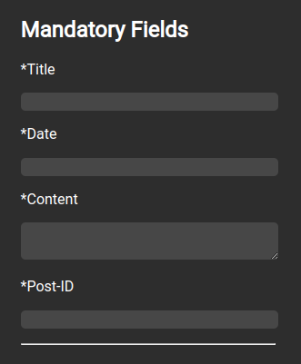
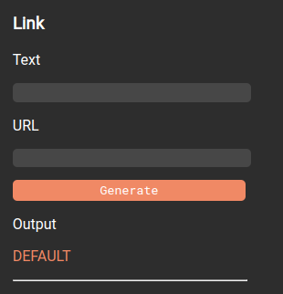
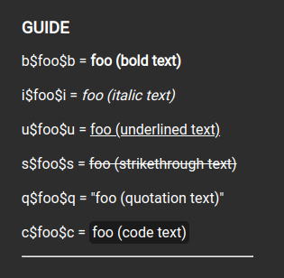

# Rhino Post Entry Tool (RPET) v-1.01

Since the Rolling Rhino Remix website currently fetches the necessary info from a JSON file, it can be very useful and save a lot of time when creating a post, but it can also be a tedious process to write everything in JSON code.

 

This is what welcomed the creation of the Rhino Post Entry Tool, which is programmed in vanilla HTML, CSS, and Javascript.
It is essentially a form that you can run in your browser, you simply fill it out, and it will generate a chunk of JSON code which you may simply copy and paste into the `news.json` file that the official website fetches from, and within minutes it will appear on the website across all devices.

 

Keep reading for help using the tool, or fast forward straight to the [rules](#rules) section to get to know a few guidelines to follow.

## Usage

### Mandatory Fields

 

The mandatory fields section is pretty self explanatory, here are the fields that you must fill out to create a standard post.
Let's look through each of these fields by themselves.

1. `*Title` - Literally just the title of the post, it can be anything, but preferably keep it short, catchy, and informative.
2. `*Date` - The date of the post's creation, please read the [rules](#rules) section to know in which format to type it out.
3. `*Content` - Now this is the main area where you write all of the important stuff, feel free to stretch out the text box to your comfort.
4. `*Post-ID` - This one is really important, this is the actual element ID of the news post, to make sure it doesn't cause overlap, test it out and change it if necessary. You will be needing this in case you share the post, and need to generate a unique URL.

### Optional Subsections

 

The optional subsections are additional sections to add on to the news post in case you need to categorize the news post into different sections, or perhaps there is just too much content to fit into one single piece.
A subsection simply has a `Title` and `Content` field, similar to the ones in the mandatory area.

## Tools

On the right side of the program you'll find different tools and elements to help make your life even easier.

### Link

 

Since your outputted fields will be converted to HTML text, a link would be created with the traditional anchor (`<a>`) tag.
To save you from having to manually write out the tag, you can use the link tool to create the HTML element for you, and then simply paste it into your `Content`.
The `Text` field is what will be set as the [innerHTML](https://developer.mozilla.org/en-US/docs/Web/API/Element/innerHTML) of the anchor/link.
The `URL` field is.. well.. the URL of the link lol.

### Guide

 

The guide shows a list of aliases that can be used in `Content` text boxes.

***note:*** Code text is a new class for text pieces that need to be shown as `code blocks`.

## Rules

Here are some rules to outline consistency within news posts...

1. All Rhino tools (`rhino-init`, `rhino-config`, `rhino-update`, `rhino-deinst`...) should be encompassed in the `code` class.
2. Content boxes are sensitive to newlines, so remember to make sure the last character isn't a newline or there will be an awkward empty space after the text.
3. All sections that bring up a new subject (e.g "What's New?" or "What's Changed?") should be inputted as subsections.
4. Please type out dates like: `month Xth, year`, X being the numerical day of the month. Some examples of this are `February 2nd, 1987`, `December 10th, 2007`, and `March 3rd, 2022`.

 

Happy news posting
